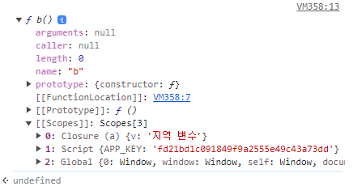

# 실행 콘텍스트

### 실행 콘텍스트

실행 콘텍스트는 **실행할 코드에 제공할 환경 정보들을 모아놓은 객체로**, 자바스크립트의 동적 언어로서의 성격을 가장 잘 파악할 수 있는 개념입니다.

실행 콘텍스트를 설명하기에 앞서, 스택과 큐의 개념을 알아야 합니다.

1. 스택: 출입구가 하나뿐인 깊은 우물 같은 데이터 구조입니다.
   - 비어있는 스택에 순서대로 데이터 a, b, c, d를 저장했다면, 꺼낼 때는 d, c, b, a 순서로 꺼내야합니다.
2. 큐: 양쪽이 모두 열려있는 파이프같은 구조입니다.
   - 양쪽 모두 입출력이 가능한 구조도 있으나 보편적으로 한쪽은 입력, 다른 한쪽은 출력을 담당합니다.

앞서 실행 콘텍스트는 `실행할 코드에 제공할 환경 정보들을 모아놓은 객체` 라고 했습니다.

동일한 환경에 있는 코드들을 실행할 때 필요한 환경 정보들을 모아 컨텍스트를 구성하고, 이를 콜스택에 쌓아올렸다가, 가장 위에 쌓여있는 컨텍스트와 관련 있는 코드들을 실행하는 식으로 전체 코드의 환경과 순서를 보장합니다.

자동으로 생성되는 전역공간과 eval을 제외하면 우리가 흔히 실행 컨텍스트를 구성하는 방법은 함수를 실행하는 것뿐입니다.

실행 콘텍스트와 콜스택 예시를 보자면,

```javascript
// ---- (1)
var a = 1;
function outer() {
  function inner() {
    console.log(a); // undefined
    var a = 3;
  }
  inner(); // ---- (2)
  console.log(a); // 1
}
outer(); // ---- (3)
console.log(a); // 1
```

1. (1) 자바스크립트 코드를 실행하는 순간 전역 컨텍스트가 **콜스택**에 담긴다.
2. (3) outer 함수를 호출하면 자바스크립트 엔진은 outer에 대한 환경 정보를 수집해서 outer 실행 컨텍스트를 생성 후 콜스택에 담는다.
3. (2) inner 함수의 실행 컨텍스트가 콜스택의 가장 위에 담기면 outer 컨텍스트와 관련된 코드의 실행을 중단하고 inner 함수 내부의 코드를 순서대로 진행한다.
4. inner 함수 실행 종료되면 콜스택에서 제거됨.
5. 아래에 있던 outer 컨텍스트가 콜스택 맨위에 존재하게 되므로, (2)의 다음줄부터 이어서 실행
6. a변수 출력하면 outer 실행 컨텍스트가 콜스택에서 제거되고, 전역 컨텍스트만 남게 됨.
7. 실행을 중단했던 (3) 다음줄 이어서 실행
8. a 변수값 출력하면 전역 공간에서 실행할 코드가 없어 전역 컨텍스트도 제거. 콜스택 비어진 채로 종료

### VariableEnvironment

> 현재 컨텍스트 내의 식별자들에 대한 정보 + 외부 환경 정보. 선언 시점의 LexicalEnvironment의 스냅샷으로, 변경 사항은 반영되지 않음.

- 실행 컨텍스트를 VariableEnvironment에 정보를 먼저 담은 다음, 이를 그대로 복사해서 LexicalEnvironment를 만들고, 이후에는 LexicalEnvironment를 주로 활용하게 됩니다.

- VariableEnvironment와 LexicalEnvironment의 내부는 environmentRecord와 outerEnvironmentReference로 구성돼있습니다.

### LexicalEnvironment

> 어휘적 환경이라 칭함.
> 수시로 변하는 환경 정보

#### environmentRecord와 호이스팅

- environmentRecord에는 현재 컨텍스트와 관련된 코드의 식별자 정보들이 저장됩니다.
- 함수, 변수 식별자 등이 해당되고, 컨텍스트 내부 전체를 처음부터 끝까지 쭉 훑어나가며 **순서대로** 수집합니다.
- 실행 컨텍스트에서 코드를 실행하기 전에 이미 변수 정보들을 **모두 수집한 상태**이기에 **자바스크립트 엔진**은 이미 해당 환경 속에 코드의 변수명등을 모두 알고 있음 - 이때, 호이스팅 개념이 나옴
  > 호이스팅: 자바스크립트 엔진은 식별자들을 최상단으로 끌어올려놓은 다음 실제 코드를 실행합니다. 즉, 자바스크립트 엔진이 실제로 끌어올리지는 않지만 편의상 끌어올린것으로 간주합니다.

##### 호이스팅 규칙

예시를 통해 규칙을 봅시다

```javascript
function a(x) {
  console.log(x); // ---- (1)
  var x;
  console.log(x); // ---- (2)
  var x = 2;
  console.log(x); // ---- (3)
}

a(1);
```

- 위 예제에서 (1)은 1이, (2)는 undefined, (3)은 2가 나올 것 같지만 예측과 다른 결과가 나옵니다.

```javascript
function a(x) {
  console.log(x); // ---- (1) --- 1
  var x;
  console.log(x); // ---- (2) --- 1
  var x = 2;
  console.log(x); // ---- (3) --- 2
}

a(1);
```

- 호이스팅에 의해 실제로 (1) 1, (2) 1, (3) 2라는 값이 나옵니다.

왜 그럴까요?

- a 함수를 실행한 순간, a 함수의 실행 컨텍스트가 생성됩니다. 이때, 변수명과 함수 선언의 정보를 위로 끌어올립니다.

호이스팅을 마친 코드를 본다면,

```javascript
function a(x) {
  var x; // 수집 대상 1의 변수 선언 부분
  var x; // 수집 대상 2의 변수 선언 부분
  var x; // 수집 대상 3의 변수 선언 부분

  x = 1; // 수집 대상 1의 할당 부분
  console.log(x); // ---- (1) --- 1
  console.log(x); // ---- (2) --- 1
  x = 2; // 수집 대상 3의 할당 부분
  console.log(x); // ---- (3) --- 2
}

a(1);
```

> **명심!** 호이스팅을 할 때 변수는 선언부와 할당부를 나누어 `선언부`만 끌어올리는 반면, 함수 선언은 `함수 전체`를 끌어올립니다.

#### 함수 선언문과 함수 표현식

호이스팅에서 함께 알아두면 좋은 내용이 있습니다. 바로 **함수 선언문과 함수 표현식**입니다.

- 함수 선언문: function 정의부만 존재하고 별도의 변수에 할당하는 것을 말합니다.
  - 반드시 함수명이 정의돼 있어야 한다.
- 함수 표현식: 정의한 function을 별로의 변수에 할당하는 것을 말합니다.
  - 함수명 없어도 됨.
    - 함수명을 정의한 함수 표현식을 `'기명 함수 표현식'`, 정의하지 않은 것을 `'익명 함수 표현식'`

```javascript
function a() {} // 함수 선언문. 함수 a가 곧 변수명
a(); // OK

var b = function () {}; // (익명) 함수 표현식. 변수명 b가 곧 함수명.
b(); // OK

var c = function d() {}; // 가명 함수 표현식. 변수명은 c, 함수명은 d.
c(); // OK
d(); // ERROR
```

> 주의!
>
> 자바스크립트에서 변수/함수를 선언할 때 동일한 변수명을 짓지 않도록 해야합니다.<br/>
> 동일한 변수명에 서로 다른 값을 할당할 경우, 나중에 할당한 값이 먼저 할당한 값을 덮어씌웁니다. (override)

#### 스코프, 스코프 체인, outerEnvironmentReference

- 스코프: 식별자에 대한 유효범위입니다.
  - ES5까지의 자바스크립트는 특이하게도 전역공간을 제외하면 오직 함수에 의해서만 스코프가 생성됩니다.
  - 스코프 체인: 이러한 '식별자의 유효범위'를 안에서부터 바깥으로 차례로 검색해나가는 것
- 그리고, 이를 가능하게 하는 것이 바로 LexicalEnvironment의 두번째 수집자료인 outerEnvironmentReference입니다.

##### 스코프 체인

outerReference는 현재 호출된 함수가 `선언될 당시`의 LexicalEnvironment참조합니다.

설명을 위해 outerEnvironmentReference를 OER, LexicalEnvironment는 LE라고 명칭하겠습니다.

- A함수 내부에 B함수를 선언하고 다시 B함수 내부에 C함수를 선언한 경우, 함수 C의 OER는 함수 B의 LE를 참조합니다.
- 함수 B의 LE에 있는 OER는 다시 함수B가 선언되던 때(A)의 LE를 참조합니다.

이처럼 OER는 연결리스트 형태를 띱니다.
이런 구조적 특성 덕분에 여러 스코프에서 동일한 식별자를 선언한 경우에는 **무조건 스코프 체인 상에서 가장 먼저 발견된 식별자에만 접근 가능**하게 됩니다.

```javascript
var a = 1;
var outer = function () {
  var inner = function () {
    console.log(a); // undefined
    var a = 3;
  };
  inner();
  console.log(a); // 1
};
outer();

console.log(a); // 1
```

##### 스코프 체인을 개발자 도구로 확인

```javascript
var v = "전역 변수";

function a() {
  //function a Execution Context(EC)
  var v = "지역 변수";

  function b() {
    //function b Execution Context
    console.log(v);
  }

  b();
}

//Global Execution Context
a();
```



b() 함수에 [[Scopes]] 속성이 존재한다. 이것이 바로 스코프 체인이다.

#### 전역변수와 지역변수

위 코드에서 잠깐 보여드렸는데

말 그대로, 전역 공간에서 선언한 변수는 전역 변수이고, 함수 내부에서 선언한 변수는 무조건 지역 변수이다.

- 위 스코프 체인 예시에서 전역 변수는 스코프에서 선언한 v와 a입니다.
- 지역 변수는 a 함수 내부에서 선언한 v와 b입니다.

전역 공간에서의 변수사용은 많은 버그를 일으킵니다.

코드의 안정성을 위해 가급적 전역변수 사용을 최소화하고, 지역 변수를 사용하는 것이 좋습니다.
